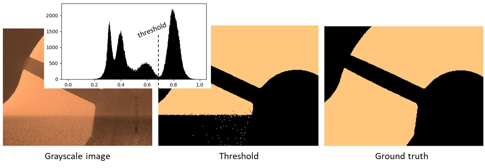

[](https://mybinder.org/v2/gh/aniketkt/CTSegNet/master?filepath=notebooks%2Fresolution_analysis.ipynb)
[](https://ctsegnet.readthedocs.io/en/latest/?badge=latest)
[](https://hub.docker.com/repository/docker/aniketkt/ct_segnet/builds)
[](https://hub.docker.com/repository/docker/aniketkt/ct_segnet/builds)


# CTSegNet

CTSegNet is a package for end-to-end 3D segmentation workflow for large X-ray tomographic datasets using 2D fully convolutional neural networks (fCNN).
<p align="center">
  
</p>

## The Package
### Installation
To install only ct_segnet modules into your python 3 environment, use pip. For compatibility with tensorflow 1.14, please install ct_segnet 1.16 from the tf-1 branch.  
```  
pip install git+https://github.com/aniketkt/CTSegNet.git@master#egg=ct_segnet  
```  

ct_segnet  
├── data_utils  
│   ├── data_augmenter.py  
│   ├── data_io.py  
│   ├── patch_maker_3D.py  
│   └── patch_maker.py  
├── model_utils  
│   ├── losses.py  
│   └── models.py  
├── seg_utils.py  
├── train_utils.py  
└── viewer.py  

CTSegNet also provides a command-line interface with config files. To download the entire package with executables, sample model files and config files, clone the master branch and install locally. To download the .h5 model files when cloning, you will need [Git LFS](https://github.com/git-lfs/git-lfs/wiki/Installation) installed.  
```
git clone https://github.com/aniketkt/CTSegNet.git
pip install CTSegNet/.
```   
### Command-line interface
While executable scripts are provided, it's easy to write your own too. Data formats supported are .tiff sequence and hdf5. Example config files are provided in cfg_files/.  
**TRAIN/TEST:**
Extract training data from arbitrarily sized CT data and ground-truth pairs.  
```
python bin/make_training_dataset.py -c cfg_files/setup_train.cfg
```  
Build and train several Unet-like fCNN architectures for an input image size of your choice.  
```  
python bin/train_fCNN.py -t cfg_files/train.cfg -m cfg_files/models/Unet242.cfg
```  
**SEGMENT:** An end-to-end 3D segmentation workflow that binarizes 2D images extracted from 3D CT data using the fCNN model, then rebuilds the corresponding 3D segmentation map. The hdf5 version is optimized for low RAM usage in very large (>50 GB) datasets.  
```
python bin/run_segmenter.py -c cfg_files/setup_seg.cfg
```
**USE HDF5 FORMAT:** Re-package your CT data into hdf5 format, with methods to determine optimal chunk size. Although optional, using hdf5 format accelerates read/write time while slicing through your datasets. Set -c as chunk size in MB or chunk shape z,y,x.
```
python bin/rw_utils/convert_to_hdf5.py -f my_tiff_folder -o output_file.hdf5 -c 20.0
```

## The Algorithm
### fCNN architecture
<p align="justify">CTSegNet deploys unique Unet-like models trained with focal loss to provide accuracy with reduced number of convolutional layers. The methodology and performance metrics are discussed in our paper<sup>1</sup>.
Here is a sample architecture that you can build using the model_utils sub-module in CTSegNet. We will refer to it as Unet-242 because of the 2-4-2 implementation of pooling layers.</p>

<p align="center">
  
</p>

### What is unique about CTSegNet?
<p align="justify">While Unet-based segmentation is now commonplace, it is primarily limited to 2D data since 3D convolutional layers require prohibitively large GPU memory during training. Our approach efficiently exploits 2D fCNNs for 3D segmentation. You can generate multiple 3D masks by slicing along any axis, and choose a patching strategy based on the resolution-to-context trade-off in your CT data. For an fCNN with input/output images sized 512<sup>2</sup>, you can make patches in several ways. This a slice drawn from a scan of a gasoline injector along the transverse plane.</p>  

<p align="center">
  
</p>  

<p align="justify">An ensemble vote from several 3D segmentations maps yields near voxel accuracy in many cases, where thresholding just won't work. Here's an example of a band-like artifact from restricted field-of-view in a CT scan (sagittal plane is shown).</p>  

<p align="center">
  
</p>

<p align="justify">The data_utils.data_io module contains the DataFile class, which enables fast and memory-efficient slicing using hdf5 format so you can visualize and segment 100GB+ datasets from your workstation. With this, you can segment only parts of your data or test models on slices of your data, with a few lines of code. Tiff format is also supported but with limited functionality.</p>  


### Tell me more
Read our paper!  
<sup>1</sup>Tekawade, Aniket, et al. *"High-fidelity geometry generation from CT data using convolutional neural networks."* Developments in X-Ray Tomography XII. Vol. 11113. International Society for Optics and Photonics, 2019.
Or contact me:  

<p align="center">atekawade [at] anl [dot] gov</p>  
